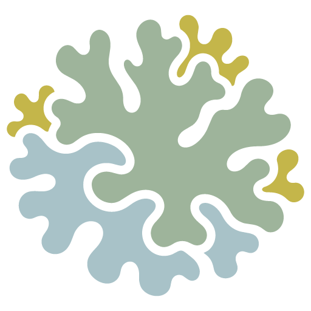
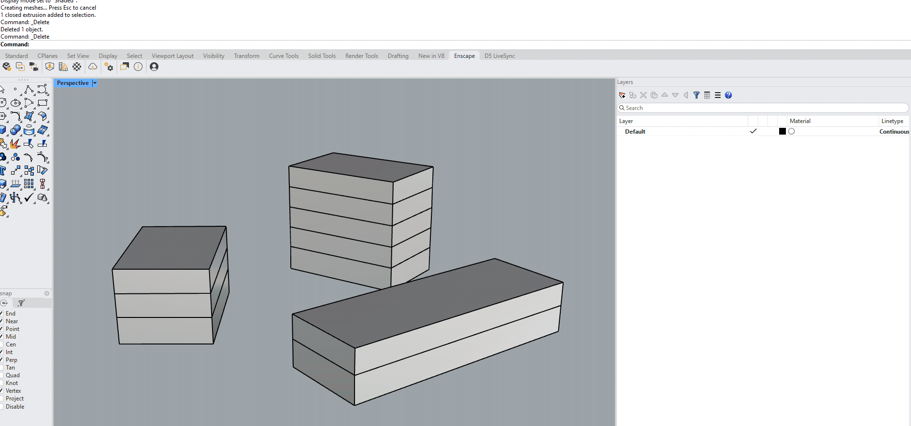
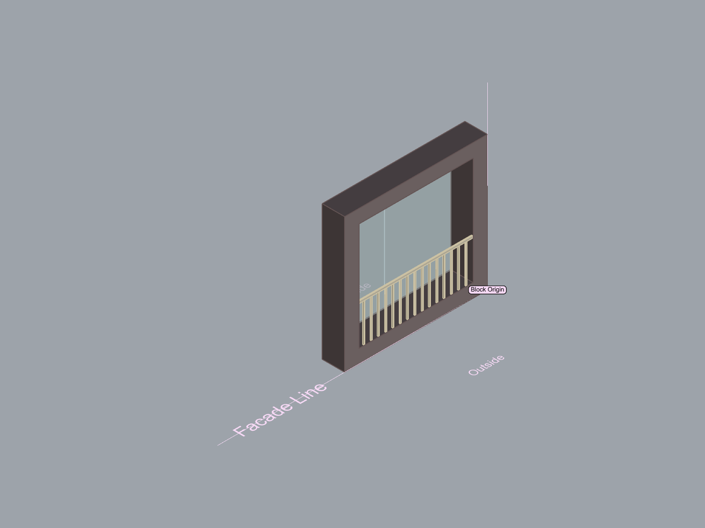
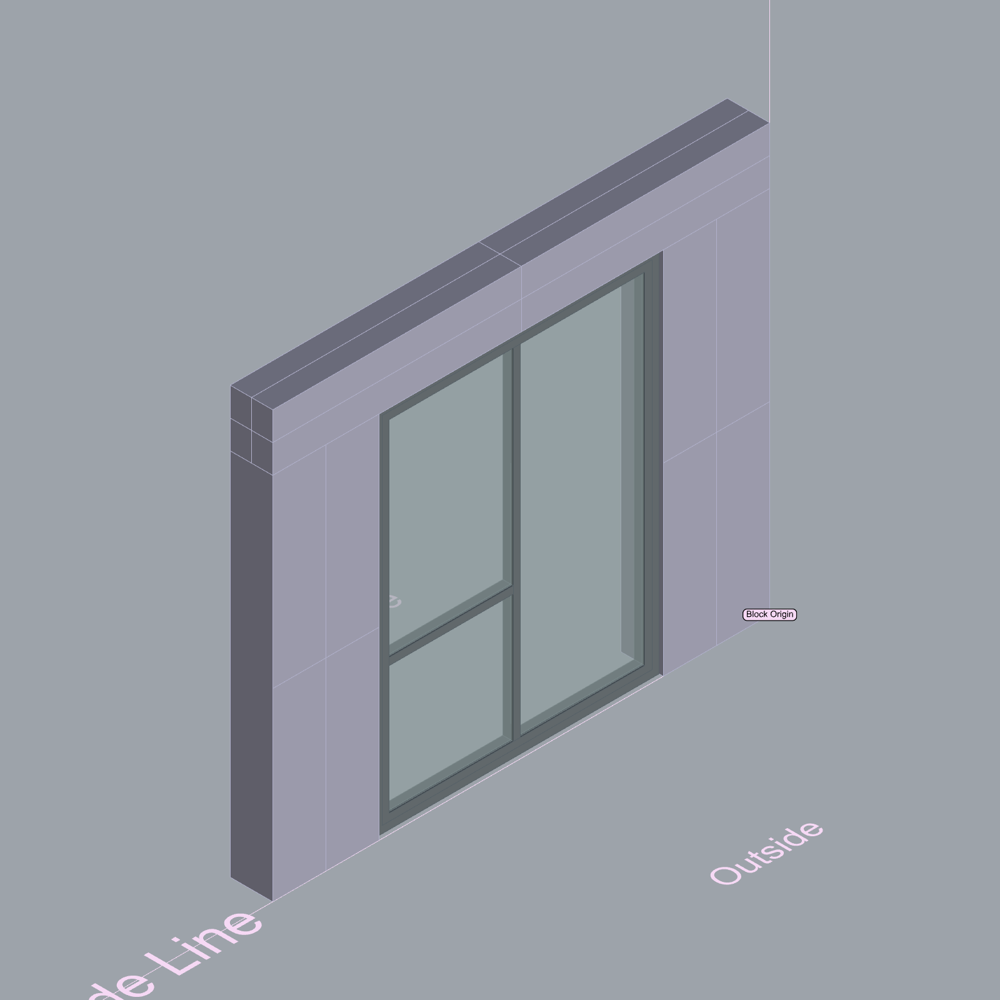
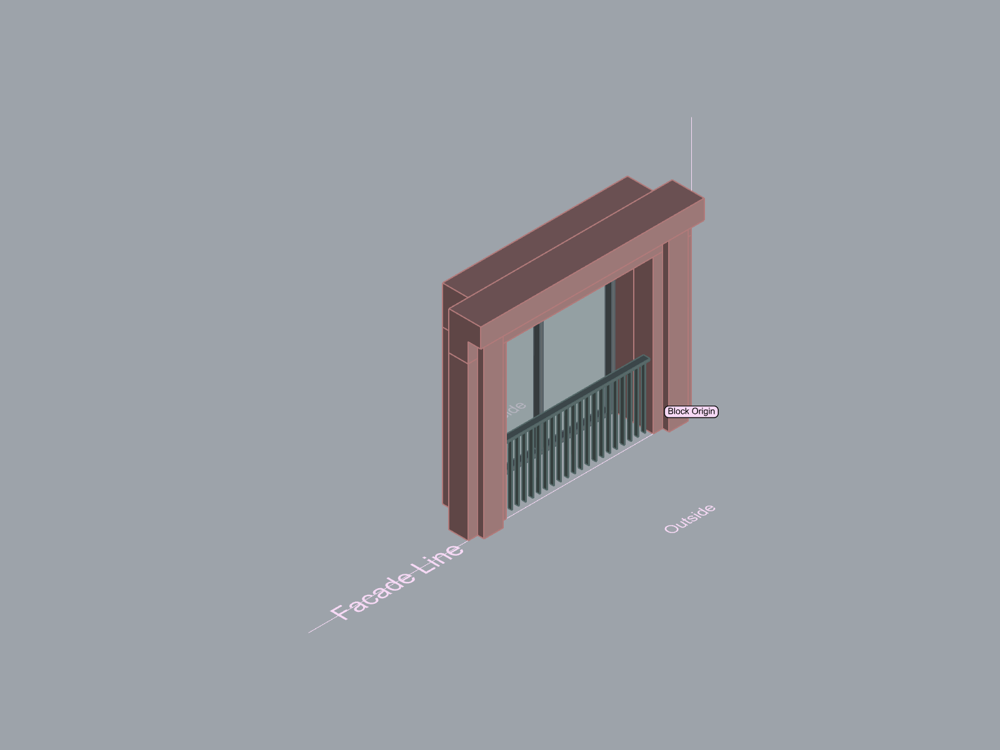

  

# Lichen

Modular facade generation tools for Rhino 8.

## Demo

  

## Installation

1. Open Rhino Package Manager
2. Enable **Include pre-releases**
3. Search for **Lichen**
4. Install

## Commands

### LichenApply

Applies a selected facade module to one or more simple building volumes.

### LichenList

Lists the facade modules currently installed with Lichen.

## Included Facades

Lichen currently includes a small library of example facade modules. Additional facades will be added over time.

## Roadmap

- Additional facade modules
- Expanded facade catalogue
- Roof options (green roof, solar panels, parapet)
- Improved placement tools
- Documentation and examples

## Facade Library

<!-- FACADE_LIBRARY_START -->

<table>
  <tr>
    <td align="center" width="33%">
       
      Lichen_Facade_001
    </td>
    <td align="center" width="33%">
       
      Lichen_Facade_002
    </td>
    <td align="center" width="33%">
       
      Lichen_Facade_003
    </td>
  </tr>
</table>
<!-- FACADE_LIBRARY_END -->

## License

This project is licensed under the MIT License — see the [LICENSE](LICENSE) file for details.
